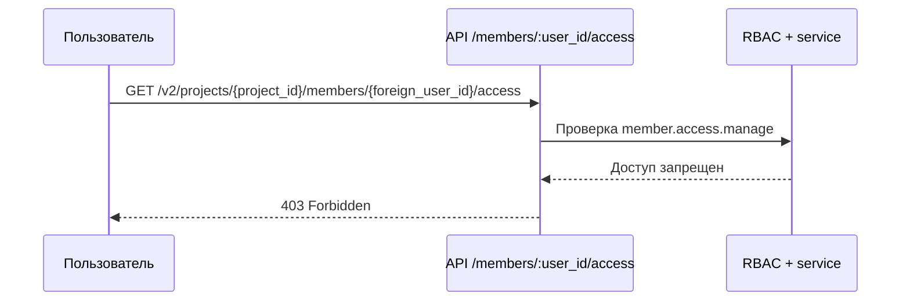
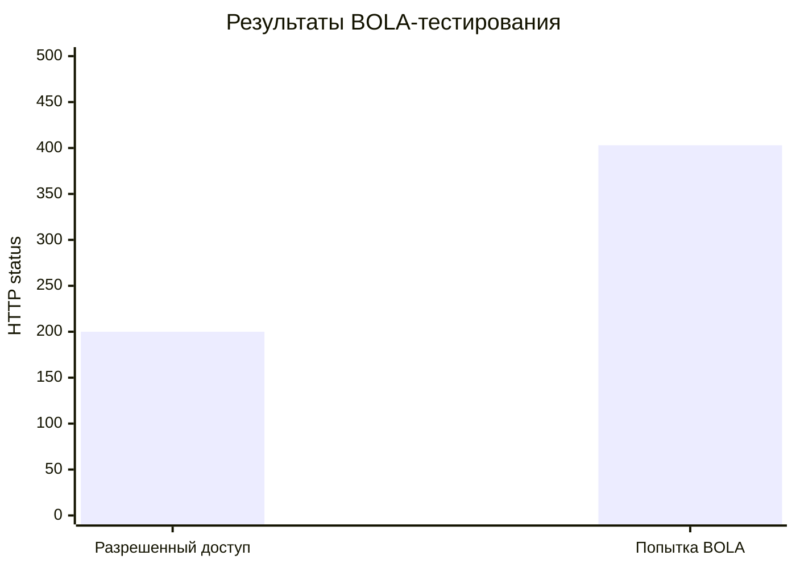

# 3.2 Тестирование API на Broken Object Level Authorization (BOLA)

## Сценарий проверки

Для проверки выбрана точка доступа:

- `GET /v2/projects/:project_id/members/:user_id/access`

В этом сценарии BOLA-атака моделируется так:

1. Пользователь входит в систему со своей ролью.
2. В URL подставляет не свой `user_id`, а идентификатор другого участника проекта.
3. API должно отклонить запрос, если у пользователя нет права `member.access.manage`.

## Автотесты

- `TestProjectFlowHandlerGetMemberAccess_UsesTransportDTO`
- `TestProjectFlowHandlerGetMemberAccess_DeniesBOLAForForeignMember`

Команда запуска:

```bash
go test ./internal/http/handlers -run 'TestProjectFlowHandlerGetMemberAccess'
```

## Матрица результатов

| Сценарий | Роль/права | Запрос | Ожидаемый результат | Фактический результат | Итог |
| --- | --- | --- | --- | --- | --- |
| Доверенный запрос к данным участника | Есть `member.access.manage` | `GET /v2/projects/{project_id}/members/{user_id}/access` | `200 OK` | `200 OK` | PASS |
| Попытка BOLA через подмену чужого `user_id` | Нет `member.access.manage` | `GET /v2/projects/{project_id}/members/{foreign_user_id}/access` | `403 Forbidden` | `403 Forbidden` | PASS |

## Диаграмма сценария



## Визуализация результата



Интерпретация:

- `200` подтверждает корректную работу легитимного сценария.
- `403` показывает, что подмена идентификатора объекта не дает доступ к чужим данным.
