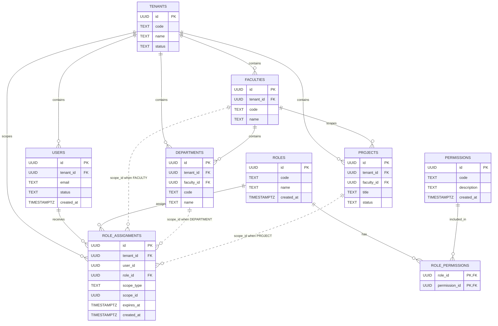

# RBAC ER Diagram

Төмендегі диаграмма 14-суретке арналған: `users`, `roles`, `permissions`, `role_permissions`, `role_assignments` және оларға жалғанатын `tenant`, `faculty`, `department`, `project` контекстері.

`role_permissions` кестесі `roles` пен `permissions` арасындағы many-to-many байланысты береді. `role_assignments` кестесі нақты пайдаланушыға белгілі бір рөлді тағайындайды және `scope_type`/`scope_id` арқылы оның контекстін анықтайды: tenant, faculty, department немесе project.
