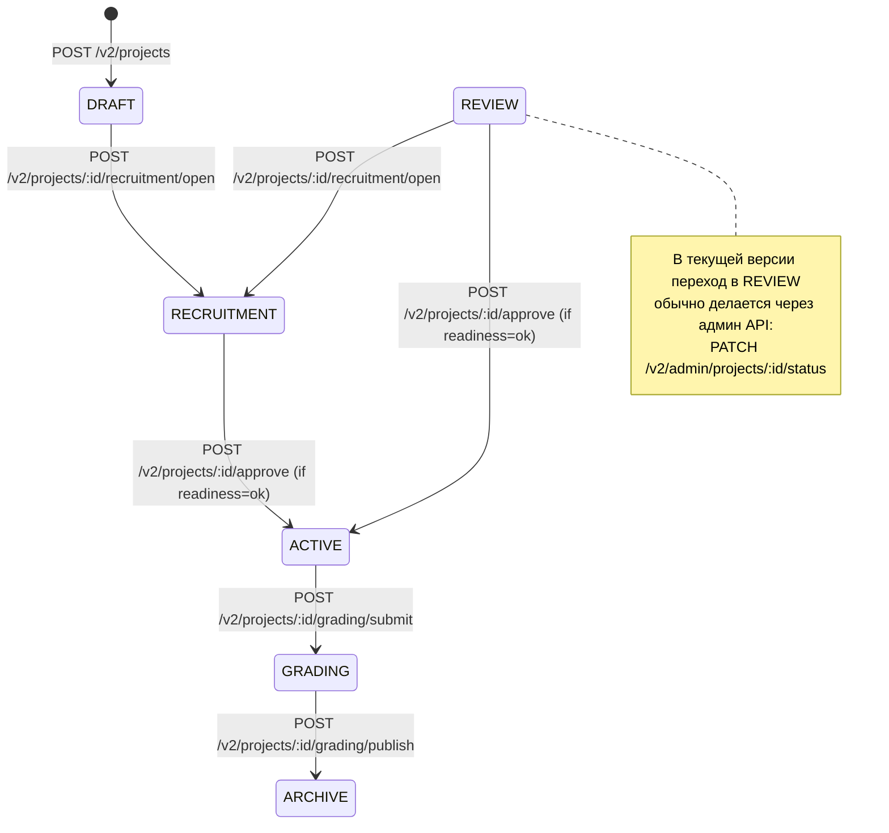

# Project Lifecycle (Текущая логика)

Документ описывает фактический lifecycle проекта в текущем коде (`projects` + `projectflow` + `admin`).

## 1. Схема статусов проекта

## 2. Статусы и подстатусы

### 2.1 Project.status
- `DRAFT`
- `REVIEW`
- `RECRUITMENT`
- `ACTIVE`
- `GRADING`
- `ARCHIVE`

### 2.2 Professor review status (`projects.professor_review_status`)
- `NONE`
- `PENDING`
- `ACCEPTED`
- `REJECTED`

### 2.3 Member status (`project_members.status`)
- `APPLIED`
- `INVITED`
- `ACTIVE`
- `REJECTED`
- `REMOVED`

### 2.4 Task status (`tasks.status`)
- `OPEN`
- `IN_PROGRESS`
- `DONE`

## 3. Шаги и требования

| Шаг | Что происходит | API | Кто может | Допустимый `project.status` | Требования | Результат |
|---|---|---|---|---|---|---|
| 1 | Создание проекта | `POST /v2/projects` | Пользователь с `project.create` в scope FACULTY (обычно `STUDENT`) | Новый проект | `title` обязателен; для private/group нужен `group_code` или `group_id` | Создается проект в `DRAFT`; автор добавляется в `project_members` как `ACTIVE`; автору выдается роль `TEAM_LEAD` (scope PROJECT) |
| 2 | Редактирование карточки | `PATCH /v2/projects/:id` | `project.edit` **или** активный участник проекта | Любой | Нужен хотя бы `title` или `description`; пустой title запрещен | Обновляются title/description |
| 3 | Настройка стека | `PUT /v2/projects/:id/stacks` | `project.edit` **или** активный участник | Любой | Коды нормализуются (trim/uppercase/уникальность) | Полностью заменяется стек проекта |
| 4 | Открытие набора | `POST /v2/projects/:id/recruitment/open` | `project.edit` | `DRAFT`, `REVIEW`, `RECRUITMENT` | - | Статус проекта становится `RECRUITMENT` |
| 5 | Создание позиций | `POST /v2/projects/:id/positions` | `position.create` | Любой | `name` обязателен; `capacity > 0` (иначе 1); code нормализуется | Добавляется позиция в проект |
| 6 | Приглашение/заявка участников | `POST /v2/projects/:id/members/invite`, `POST /v2/projects/:id/members/apply`, `POST /v2/projects/:id/members/respond`, `POST /v2/projects/:id/members/:user_id/approve` | Lead/менеджер (`member.approve`) или студент (`member.apply`) | Для invite/apply/respond/approve нужен только `RECRUITMENT` | Для apply можно передать `comment`; для invite: студент должен быть активным в faculty; нельзя приглашать себя/owner; при accept проверяется capacity; approve требует `position_id` и свободное место | `INVITED/APPLIED -> ACTIVE`; при активации выдается роль `MEMBER`; у invitee снимается роль `INVITED_MEMBER` |
| 7 | Смена позиции участника | `PATCH /v2/projects/:id/members/:user_id/position` | `member.approve` | Любой | Участник должен быть `ACTIVE`; в позиции должно быть место | Обновляется `position_id` |
| 8 | Назначение преподавателя | `POST /v2/projects/:id/professor` | `project.invite_professor` | Любой | Преподаватель активен и в той же faculty; нельзя назначить себя/owner | `professor_id` обновляется; `professor_review_status -> PENDING` |
| 9 | Ответ преподавателя | `POST /v2/projects/:id/professor/respond` | Назначенный преподаватель | Любой (по факту действует только при `PENDING`) | Запрос должен идти от `professor_id`; принимается только из `PENDING` | `professor_review_status -> ACCEPTED/REJECTED`; при accept выдается роль `PROJECT_PROFESSOR` |
| 10 | Добавление критериев | `POST /v2/projects/:id/criteria` | `project.set_criteria` | Любой | `title` обязателен; вес 1..100; суммарный вес всех критериев `<= 100` | Добавляется criterion |
| 11 | Проверка готовности | `GET /v2/projects/:id/readiness` | `project.view` | Любой | Формула `can_activate`: `required_members > 0 && active_members >= required_members && professor_status == ACCEPTED && criteria_count > 0` | Возвращается readiness-сводка |
| 12 | Запуск проекта | `POST /v2/projects/:id/approve` | `project.approve` | Фактически `REVIEW` или `RECRUITMENT` | `readiness.can_activate` должен быть `true` | Проект переводится в `ACTIVE` |
| 13 | Работа с задачами | `POST /v2/projects/:id/tasks`, `PATCH /v2/projects/:id/tasks/:task_id/status`, `PATCH /v2/projects/:id/tasks/:task_id/assignee`, `POST /v2/projects/:id/tasks/:task_id/claim`, `POST /v2/projects/:id/tasks/:task_id/complete` | `task.create`/`task.update`/`task.assign`/`task.claim` | Только `ACTIVE` | Claim: только `OPEN` и соответствие позиции; Complete: только назначенный исполнитель и статус `IN_PROGRESS` | Задачи проходят `OPEN -> IN_PROGRESS -> DONE`; пишутся activity logs; у complete сохраняется submission |
| 14 | Отправка на оценивание | `POST /v2/projects/:id/grading/submit` | `project.submit_for_review` **или** активный участник проекта | Только `ACTIVE` | Нужен назначенный преподаватель с `professor_review_status=ACCEPTED`; задач >= 1; все задачи `DONE` | Проект переводится в `GRADING` |
| 15 | Возврат на пересдачу | `POST /v2/projects/:id/grading/return` | `grading.publish` | Только `GRADING` | Действие доступно только назначенному преподавателю | Проект возвращается в `ACTIVE`; `retake_count += 1`; следующая итоговая оценка получает штраф |
| 16 | Оценивание и финал | `PUT /v2/projects/:id/grading`, `POST /v2/projects/:id/grading/publish` | `grading.mark_criteria` / `grading.publish` | `PUT`: `REVIEW` или `GRADING`; `publish`: только `GRADING` | Publish только назначенным профессором; критериев > 0; по каждому критерию должна стоять оценка (`is_met` не null) | Проект переводится в `COMPLETED`; итоговая оценка учитывает штраф `5%` за каждую пересдачу (cap `25%`) |
| 17 | Удаление проекта владельцем | `DELETE /v2/projects/:id` | Только owner (`created_by`) | Любой | Проверяется владелец | Проект удаляется; project-scope роли очищаются |

## 4. Ключевые формулы/блокеры

### 4.1 Блокер запуска (`POST /approve`)
Проект не запустится в `ACTIVE`, если не выполнено хотя бы одно:
- не создано ни одной позиции (`required_members == 0`);
- активных участников с назначенной позицией меньше, чем суммарная capacity;
- приглашение преподавателя не в `ACCEPTED`;
- нет ни одного критерия.

### 4.2 Блокер отправки на грейдинг (`POST /grading/submit`)
Проект не перейдет в `GRADING`, если:
- статус не `ACTIVE`;
- преподаватель не назначен;
- приглашение преподавателя не `ACCEPTED`;
- нет задач;
- есть хотя бы одна задача не в `DONE`.

### 4.3 Блокер публикации оценки (`POST /grading/publish`)
Проект не перейдет в `COMPLETED`, если:
- статус не `GRADING`;
- действие выполняет не назначенный преподаватель;
- критерии не настроены;
- не проставлены оценки по всем критериям.

### 4.4 Возврат на пересдачу (`POST /grading/return`)
Проект не вернется в `ACTIVE`, если:
- статус не `GRADING`;
- действие выполняет не назначенный преподаватель.

## 5. Админское ручное управление статусом

Админ может вручную менять `project.status`:
- `PATCH /v2/admin/projects/:id/status`
- Допустимые значения: `DRAFT | REVIEW | RECRUITMENT | ACTIVE | GRADING | COMPLETED | ARCHIVE`

Это bypass обычного flow и используется как операционный override.

## 6. Где смотреть реализацию

- `internal/services/projects/service.go`
- `internal/services/projectflow/service_members.go`
- `internal/services/projectflow/service_professors.go`
- `internal/services/projectflow/service_grading.go`
- `internal/services/projectflow/service_tasks.go`
- `internal/repos/postgres/projectflow_repo_lifecycle.go`
- `internal/repos/postgres/projectflow_repo_tasks.go`
- `internal/http/router_projectflow.go`
- `internal/http/router_projects.go`
- `internal/http/router_admin.go`
