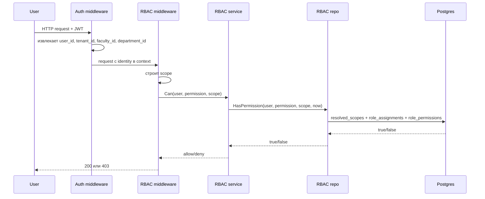

# Структурированное описание проекта IDSAI Core

Документ подготовлен по текущему состоянию репозитория `idsai-core-up`.

## 1. Общая архитектура проекта

### 1.1 Полное название проекта

Основное название в `README.md`: **IDSAI Core**.

В Swagger-аннотациях `cmd/api/main.go` API называется **IDSAI Corp. API**.

### 1.2 Назначение проекта

IDSAI Core - backend и встроенный web-интерфейс для управления учебными проектами. Приложение объединяет регистрацию и вход пользователей, RBAC, жизненный цикл проектов, набор команды, задачи, кабинет преподавателя, оценивание, уведомления, административную панель и knowledge base.

### 1.3 Технологический стек

| Слой | Технологии |
|---|---|
| Backend-язык | Go `1.25.0` |
| Backend-framework | Gin `github.com/gin-gonic/gin` |
| База данных | PostgreSQL, драйвер `pgx/v5`, миграции `goose` |
| Кэш | Redis для кэша RBAC, graceful degradation при недоступности |
| Хранилище медиа | MinIO / S3-compatible storage, локальное `/media` при настройке |
| Frontend | Встроенный server-rendered/static frontend: HTML, CSS, vanilla JavaScript через `embed.FS` |
| Документация API | Swagger/OpenAPI файлы в `docs/swagger` |

### 1.4 Архитектурный стиль

Приложение является **модульным монолитом**, а не микросервисной системой.

В `docs/architecture/ARCHITECTURE.md` зафиксирован подход **Modular Monolith + Clean (Ports & Adapters)**:

- один deploy;
- одна PostgreSQL database;
- модули отделены по bounded context;
- SQL изолируется в `internal/repos/postgres`;
- use-case логика находится в `internal/services`;
- HTTP transport находится в `internal/http`.

### 1.5 Микросервисы

Микросервисов нет. Вместо них используются внутренние модули:

| Модуль | Назначение |
|---|---|
| `internal/modules/auth` | Сборка auth repo/service/handler |
| `internal/modules/admin` | Администрирование пользователей и проектов |
| `internal/modules/rbac` | RBAC repo/service/authorizer/cache wiring |
| `internal/modules/projects` | Базовая работа с проектами |
| `internal/modules/projectflow` | Lifecycle проекта, команда, задачи, grading |
| `internal/modules/notifications` | In-app notifications и outbox |
| `internal/modules/kb` | Knowledge base |

### 1.6 Структура файлов и папок

Упрощенный результат `tree -a -L 3 -I '.git|.tmp' .`:

```text
.
├── cmd
│   ├── api
│   │   └── main.go
│   └── migrate
│       └── main.go
├── docker
│   └── entrypoint.sh
├── docs
│   ├── ADMIN_GUIDE.md
│   ├── BOLA_TESTING.md
│   ├── PROJECT_LIFECYCLE.md
│   ├── TESTING_REPORT.md
│   ├── architecture
│   │   ├── ARCHITECTURE.md
│   │   └── RBAC_HIERARCHY.md
│   └── swagger
│       ├── docs.go
│       ├── swagger.json
│       └── swagger.yaml
├── internal
│   ├── app
│   ├── architecture
│   ├── config
│   ├── db
│   ├── domain
│   ├── http
│   │   ├── dto
│   │   ├── frontend
│   │   ├── handlers
│   │   ├── middleware
│   │   ├── router.go
│   │   ├── router_admin.go
│   │   ├── router_auth.go
│   │   ├── router_notifications.go
│   │   ├── router_projectflow.go
│   │   ├── router_projects.go
│   │   ├── router_public.go
│   │   └── routes_kb.go
│   ├── infra
│   │   ├── alerts
│   │   ├── cache
│   │   ├── email
│   │   ├── images
│   │   ├── kzschools
│   │   ├── photon
│   │   └── storage
│   ├── modules
│   │   ├── admin
│   │   ├── auth
│   │   ├── kb
│   │   ├── notifications
│   │   ├── projectflow
│   │   ├── projects
│   │   └── rbac
│   ├── repos
│   │   └── postgres
│   ├── requestctx
│   ├── security
│   │   └── passwords
│   └── services
│       ├── admin
│       ├── auth
│       ├── kb
│       ├── notifications
│       ├── projectflow
│       ├── projects
│       └── rbac
├── migrations
│   ├── 00002_rbac.sql
│   ├── 00004_project_view_permission.sql
│   ├── 00008_team_permissions.sql
│   ├── 00011_rbac_department_scope.sql
│   ├── 00015_multitenant_notifications_docs.sql
│   ├── 00019_invited_member_role.sql
│   ├── 00030_rbac_role_assignments_unique.sql
│   ├── 00031_rbac_tenant_admin.sql
│   ├── 00032_rbac_backfill_tenant_admin.sql
│   ├── 00033_rbac_project_security_permissions.sql
│   ├── 00036_rbac_project_view_for_project_roles.sql
│   ├── 00037_rbac_professor_faculty_project_read.sql
│   ├── 00038_rbac_delegated_project_roles.sql
│   └── 00040_task_delete_permission.sql
├── Dockerfile
├── Makefile
├── README.md
├── docker-compose.yml
├── go.mod
├── go.sum
└── render.yaml
```

## 2. Аутентификация и авторизация

### 2.1 Используется ли JWT

Да. Access token является JWT, подписывается `HS256` через `github.com/golang-jwt/jwt/v5`.

Файл генерации токена: `internal/services/auth/service.go`, функция `issueTokens`.

JWT claims:

```go
claims := jwt.MapClaims{
  "tenant_id":     tenantID.String(),
  "faculty_id":    facultyID.String(),
  "department_id": deptID.String(),
  "is_admin":      isAdmin,
  "is_professor":  isProfessor,
  "sub":           userID.String(),
  "iat":           now.Unix(),
  "exp":           now.Add(s.accessTTL).Unix(),
  "iss":           TokenIssuer,
  "jti":           uuid.NewString(),
  "pwd_at":        passwordChangedUnixMilli(passwordChangedAt),
}
```

`TokenIssuer = "idsai-core-up"`.

Refresh token не является JWT: это случайная строка, в БД хранится ее hash в таблице `refresh_tokens`.

### 2.2 Как передается токен

Поддерживаются два способа.

1. **Cookie mode**, основной режим встроенного frontend:
   - access cookie: `idsai_access`;
   - refresh cookie: `idsai_refresh`;
   - cookies устанавливаются как `HttpOnly`, `SameSite=Lax`;
   - `Secure` включается, если запрос пришел по HTTPS или с `X-Forwarded-Proto: https`.

2. **Bearer token mode**, API-режим:
   - если клиент отправляет `X-Auth-Mode: token` на `/v2/auth/login` или `/v2/auth/refresh`, сервер возвращает JSON с `access_token` и `refresh_token`;
   - `AuthRequired` также принимает `Authorization: Bearer <token>`.

Логика извлечения access token в `internal/http/middleware/auth.go`:

```go
if cookie, err := c.Cookie(authsvc.AccessCookieName); err == nil {
  raw = strings.TrimSpace(cookie)
}
if raw == "" {
  h := c.GetHeader("Authorization")
  if h != "" && strings.HasPrefix(h, "Bearer ") {
    raw = strings.TrimSpace(strings.TrimPrefix(h, "Bearer "))
  }
}
```

### 2.3 Где токен хранится на клиенте

Для встроенного frontend основной вариант хранения - **HttpOnly cookies**, которые недоступны JavaScript.

`internal/http/frontend/js/auth-session.js` отправляет запросы с:

```js
const opts = { credentials: "same-origin", ...options };
return fetch(url, opts);
```

В JS также есть legacy/local state ключи:

- `idsai_access_token`;
- `idsai_refresh_token`;
- `idsai_rbac_user_id`;
- `idsai_rbac_faculty_id`;
- `idsai_is_admin`;
- `idsai_is_professor`.

Но текущий `login.js` после входа сохраняет профиль и флаги роли, а не access/refresh token. Поэтому для обычного web-интерфейса авторизация держится на cookie.

### 2.4 Middleware для проверки аутентификации и авторизации

| Middleware | Файл | Назначение |
|---|---|---|
| `AuthRequired` | `internal/http/middleware/auth.go` | Проверяет JWT из cookie или `Authorization: Bearer`, валидирует issuer/signature/claims, проверяет актуальное состояние пользователя в БД, кладет `userID`, `tenantID`, `facultyID`, `departmentID`, `isAdmin`, `isProfessor` в `gin.Context` |
| `AdminRequired` | `internal/http/middleware/auth.go` | Проверяет флаг `isAdmin` из JWT/context, иначе возвращает `403` |
| `RequirePermission` | `internal/http/middleware/rbac.go` | Проверяет один permission через `rbac.Authorizer.Can` в заданном scope |
| `RequirePermissionIf` | `internal/http/middleware/rbac.go` | Feature-flag wrapper вокруг `RequirePermission` |
| `RequireAllPermissions` | `internal/http/middleware/rbac.go` | Проверяет наличие всех permissions |
| `RequirePermissionWithAttrs` | `internal/http/middleware/rbac.go` | RBAC + ABAC: после permission check проверяет runtime attributes |

Scope resolvers:

- `SystemScope()`;
- `TenantScopeFromCtx()`;
- `FacultyScopeFromCtx()`;
- `DepartmentScopeFromCtx()`;
- `ProjectScopeFromParam("project_id")`;
- `FacultyScopeFromHeader(header)`.

### 2.5 Все роли в системе

Каталог ролей хранится в таблице `roles`.

| Роль | Типичный scope | Назначение |
|---|---|---|
| `SUPER_ADMIN` | `SYSTEM` | Системный администратор |
| `TENANT_ADMIN` | `TENANT` | Администратор tenant |
| `STUDENT` | `FACULTY` | Студент, может создавать проекты и подавать заявки в рамках faculty |
| `PROFESSOR` | `FACULTY` | Преподаватель, может видеть проекты faculty и отвечать на invite |
| `MODERATOR` | `FACULTY` | Модерация free projects |
| `TEAM_LEAD` | `PROJECT` | Автор/лидер проекта |
| `MEMBER` | `PROJECT` | Активный участник проекта |
| `INVITED_MEMBER` | `PROJECT` | Приглашенный участник до принятия |
| `PROJECT_PROFESSOR` | `PROJECT` | Преподаватель, закрепленный за проектом |
| `CO_LEAD` | `PROJECT` | Делегированная роль помощника тимлида |
| `RECRUITER` | `PROJECT` | Делегированная роль для управления набором |
| `TASK_MANAGER` | `PROJECT` | Делегированная роль для управления задачами |

Важно: `APPLIED` встречается в lifecycle участников как `project_members.status`, но не является записью в `roles`.

### 2.6 Как реализованы права доступа

Реализация permission-based RBAC:

- роли лежат в `roles`;
- permission-коды лежат в `permissions`;
- связь роль -> права лежит в `role_permissions`;
- назначение роли пользователю лежит в `role_assignments`;
- проверка прав идет через `rbac.Authorizer` и SQL repository.

То есть права не зашиты напрямую в код ролей. Маршруты проверяют permission-коды (`project.create`, `member.approve`, `task.delete` и т.д.), а role-to-permission mapping хранится в БД.

Есть дополнительная ABAC-заготовка:

- `internal/services/rbac/condition.go`;
- `internal/services/rbac/service.go`;
- `internal/modules/rbac/module.go`.

В `module.go` зарегистрировано условие для `task.edit`, но реальные маршруты используют `task.update`; поэтому фактически основные route checks сейчас RBAC/permission-based.

### 2.7 Контекстно-зависимые роли

Да. Контекст задается в `role_assignments.scope_type` и `role_assignments.scope_id`.

Поддерживаемые scope:

- `SYSTEM`;
- `TENANT`;
- `FACULTY`;
- `DEPARTMENT`;
- `PROJECT`.

Пользователь может иметь разные роли в разных контекстах. Например:

- `STUDENT @ FACULTY A`;
- `TEAM_LEAD @ PROJECT X`;
- `MEMBER @ PROJECT Y`;
- `CO_LEAD @ PROJECT Z`.

RBAC реализован как **hierarchical scoped RBAC**. При проверке `PROJECT`-scope репозиторий разворачивает его в цепочку:

```text
SYSTEM -> TENANT -> FACULTY -> PROJECT
```

Это позволяет, например, роли `STUDENT @ FACULTY` дать право `member.apply` на проект внутри этой faculty.

## 3. Схема базы данных

### 3.1 RBAC-таблицы и наличие сущностей

| Сущность из запроса | Есть? | Фактическое имя |
|---|---:|---|
| `users` | Да | `users` |
| `roles` | Да | `roles` |
| `permissions` | Да | `permissions` |
| `user_roles` | Нет | Вместо нее используется `role_assignments` |
| `role_permissions` | Да | `role_permissions` |

Дополнительно важны:

- `user_profiles` - профиль пользователя, faculty/department/group;
- `tenants`, `faculties`, `departments`, `student_groups`, `projects` - предметные scope-сущности;
- `refresh_tokens`, `auth_tokens` - auth/session tables.

### 3.2 Колонки RBAC-таблиц

#### `users`

Итоговая схема собирается миграциями `00010`, `00015`, `00024`, `00025`.

| Колонка | Назначение |
|---|---|
| `id UUID PRIMARY KEY` | Идентификатор пользователя |
| `tenant_id UUID NOT NULL` | Tenant пользователя |
| `email TEXT NOT NULL UNIQUE` | Email |
| `password_hash TEXT NOT NULL` | Hash пароля |
| `status TEXT NOT NULL` | `ACTIVE`, `PENDING`, `DISABLED` |
| `created_at TIMESTAMPTZ NOT NULL` | Дата создания |
| `email_verified_at TIMESTAMPTZ NULL` | Подтверждение email |
| `password_changed_at TIMESTAMPTZ NOT NULL` | Версия пароля для invalidation JWT |
| `pending_email TEXT NULL` | Новый email в процессе смены |
| `pending_email_requested_at TIMESTAMPTZ NULL` | Дата запроса смены email |
| `avatar_key TEXT NULL` | Ключ аватара в storage |
| `avatar_updated_at TIMESTAMPTZ NULL` | Дата обновления аватара |

#### `roles`

| Колонка | Назначение |
|---|---|
| `id UUID PRIMARY KEY` | Идентификатор роли |
| `code TEXT NOT NULL UNIQUE` | Машинный код роли |
| `name TEXT NOT NULL` | Человекочитаемое название |
| `created_at TIMESTAMPTZ NOT NULL` | Дата создания |

#### `permissions`

| Колонка | Назначение |
|---|---|
| `id UUID PRIMARY KEY` | Идентификатор permission |
| `code TEXT NOT NULL UNIQUE` | Машинный permission-код |
| `description TEXT NOT NULL` | Описание |
| `created_at TIMESTAMPTZ NOT NULL` | Дата создания |

#### `role_permissions`

| Колонка | Назначение |
|---|---|
| `role_id UUID NOT NULL` | FK на `roles(id)` |
| `permission_id UUID NOT NULL` | FK на `permissions(id)` |

Primary key: `(role_id, permission_id)`.

#### `role_assignments`

| Колонка | Назначение |
|---|---|
| `id UUID PRIMARY KEY` | Идентификатор назначения |
| `tenant_id UUID NOT NULL` | Tenant назначения |
| `user_id UUID NOT NULL` | Пользователь |
| `role_id UUID NOT NULL` | FK на `roles(id)` |
| `scope_type TEXT NOT NULL` | `SYSTEM`, `TENANT`, `FACULTY`, `DEPARTMENT`, `PROJECT` |
| `scope_id UUID NULL` | ID scope-сущности; `NULL` для `SYSTEM` |
| `expires_at TIMESTAMPTZ NULL` | Временное назначение |
| `created_at TIMESTAMPTZ NOT NULL` | Дата создания |

Индексы:

- `idx_role_assignments_user_scope(user_id, scope_type, scope_id)`;
- `idx_role_assignments_tenant(tenant_id)`;
- `ux_role_assignments_tuple_scoped(tenant_id, user_id, role_id, scope_type, scope_id) WHERE scope_id IS NOT NULL`;
- `ux_role_assignments_tuple_system(tenant_id, user_id, role_id, scope_type) WHERE scope_id IS NULL`.

### 3.3 Связи между таблицами

```text
users 1--N role_assignments
roles 1--N role_assignments
roles N--M permissions через role_permissions
tenants 1--N role_assignments
```

`role_assignments.scope_id` является polymorphic reference:

- если `scope_type = 'TENANT'`, то `scope_id` указывает на `tenants.id`;
- если `scope_type = 'FACULTY'`, то `scope_id` указывает на `faculties.id`;
- если `scope_type = 'DEPARTMENT'`, то `scope_id` указывает на `departments.id`;
- если `scope_type = 'PROJECT'`, то `scope_id` указывает на `projects.id`;
- если `scope_type = 'SYSTEM'`, то `scope_id IS NULL`.

Жесткого FK на `scope_id` нет, потому что это polymorphic scope.

### 3.4 Migration-файлы, относящиеся к RBAC

Основные RBAC migrations:

- `migrations/00002_rbac.sql` - базовые таблицы, роли, permissions, role_permissions;
- `migrations/00004_project_view_permission.sql` - `project.view`;
- `migrations/00008_team_permissions.sql` - `position.create`, `member.apply`, `member.approve`, `task.claim`;
- `migrations/00011_rbac_department_scope.sql` - добавление `DEPARTMENT` scope;
- `migrations/00015_multitenant_notifications_docs.sql` - `TENANT` scope и `tenant_id`;
- `migrations/00019_invited_member_role.sql` - `INVITED_MEMBER`;
- `migrations/00022_member_submit_for_grading.sql` - право submit для `MEMBER`;
- `migrations/00030_rbac_role_assignments_unique.sql` - unique indexes на assignments;
- `migrations/00031_rbac_tenant_admin.sql` - `TENANT_ADMIN`;
- `migrations/00032_rbac_backfill_tenant_admin.sql` - backfill tenant admin из super admin;
- `migrations/00033_rbac_project_security_permissions.sql` - `project.delete`, `project.review.respond`;
- `migrations/00036_rbac_project_view_for_project_roles.sql` - `project.view` для project roles;
- `migrations/00037_rbac_professor_faculty_project_read.sql` - faculty-level read для `PROFESSOR`;
- `migrations/00038_rbac_delegated_project_roles.sql` - `CO_LEAD`, `RECRUITER`, `TASK_MANAGER`, `member.access.manage`;
- `migrations/00040_task_delete_permission.sql` - `task.delete`.

### 3.5 Содержимое RBAC migration-файлов

Ниже приведены ключевые RBAC-фрагменты. Полные файлы находятся в `migrations/`.

#### `00002_rbac.sql`

```sql
CREATE TABLE IF NOT EXISTS roles (
  id UUID PRIMARY KEY DEFAULT gen_random_uuid(),
  code TEXT NOT NULL UNIQUE,
  name TEXT NOT NULL,
  created_at TIMESTAMPTZ NOT NULL DEFAULT now()
);

CREATE TABLE IF NOT EXISTS permissions (
  id UUID PRIMARY KEY DEFAULT gen_random_uuid(),
  code TEXT NOT NULL UNIQUE,
  description TEXT NOT NULL,
  created_at TIMESTAMPTZ NOT NULL DEFAULT now()
);

CREATE TABLE IF NOT EXISTS role_permissions (
  role_id UUID NOT NULL REFERENCES roles(id) ON DELETE CASCADE,
  permission_id UUID NOT NULL REFERENCES permissions(id) ON DELETE CASCADE,
  PRIMARY KEY (role_id, permission_id)
);

CREATE TABLE IF NOT EXISTS role_assignments (
  id UUID PRIMARY KEY DEFAULT gen_random_uuid(),
  user_id UUID NOT NULL,
  role_id UUID NOT NULL REFERENCES roles(id) ON DELETE CASCADE,
  scope_type TEXT NOT NULL,
  scope_id UUID NULL,
  expires_at TIMESTAMPTZ NULL,
  created_at TIMESTAMPTZ NOT NULL DEFAULT now(),
  CONSTRAINT role_assignments_scope_check
    CHECK (scope_type IN ('SYSTEM', 'FACULTY', 'PROJECT')),
  CONSTRAINT role_assignments_scope_id_check
    CHECK (
      (scope_type = 'SYSTEM' AND scope_id IS NULL)
      OR (scope_type IN ('FACULTY','PROJECT') AND scope_id IS NOT NULL)
    )
);

CREATE INDEX IF NOT EXISTS idx_role_assignments_user_scope
  ON role_assignments(user_id, scope_type, scope_id);

INSERT INTO roles(code, name) VALUES
  ('SUPER_ADMIN', 'Super Admin'),
  ('STUDENT', 'Student'),
  ('PROFESSOR', 'Professor'),
  ('MODERATOR', 'Moderator'),
  ('TEAM_LEAD', 'Team Lead'),
  ('MEMBER', 'Project Member'),
  ('PROJECT_PROFESSOR', 'Project Professor')
ON CONFLICT (code) DO NOTHING;
```

#### `00011_rbac_department_scope.sql`

```sql
ALTER TABLE role_assignments
ADD CONSTRAINT role_assignments_scope_type_check
CHECK (scope_type IN ('SYSTEM','FACULTY','DEPARTMENT','PROJECT'));
```

#### `00015_multitenant_notifications_docs.sql`

```sql
CREATE TABLE IF NOT EXISTS tenants (
  id UUID PRIMARY KEY,
  code TEXT NOT NULL UNIQUE,
  name TEXT NOT NULL,
  status TEXT NOT NULL DEFAULT 'ACTIVE',
  created_at TIMESTAMPTZ NOT NULL DEFAULT now(),
  CONSTRAINT tenants_status_check CHECK (status IN ('ACTIVE', 'DISABLED'))
);

ALTER TABLE users ADD COLUMN IF NOT EXISTS tenant_id UUID NOT NULL DEFAULT '00000000-0000-0000-0000-000000000001';
ALTER TABLE role_assignments ADD COLUMN IF NOT EXISTS tenant_id UUID NOT NULL DEFAULT '00000000-0000-0000-0000-000000000001';
ALTER TABLE projects ADD COLUMN IF NOT EXISTS tenant_id UUID NOT NULL DEFAULT '00000000-0000-0000-0000-000000000001';

ALTER TABLE role_assignments DROP CONSTRAINT IF EXISTS role_assignments_scope_type_check;
ALTER TABLE role_assignments
  ADD CONSTRAINT role_assignments_scope_type_check
  CHECK (scope_type IN ('SYSTEM', 'TENANT', 'FACULTY', 'DEPARTMENT', 'PROJECT'));

ALTER TABLE role_assignments
  ADD CONSTRAINT role_assignments_tenant_fk
  FOREIGN KEY (tenant_id) REFERENCES tenants(id) ON DELETE RESTRICT;
```

#### `00030_rbac_role_assignments_unique.sql`

```sql
CREATE UNIQUE INDEX IF NOT EXISTS ux_role_assignments_tuple_scoped
ON role_assignments(tenant_id, user_id, role_id, scope_type, scope_id)
WHERE scope_id IS NOT NULL;

CREATE UNIQUE INDEX IF NOT EXISTS ux_role_assignments_tuple_system
ON role_assignments(tenant_id, user_id, role_id, scope_type)
WHERE scope_id IS NULL;
```

#### `00031_rbac_tenant_admin.sql`

```sql
INSERT INTO roles(code, name)
VALUES ('TENANT_ADMIN', 'Tenant Admin')
ON CONFLICT (code) DO NOTHING;

INSERT INTO permissions(code, description) VALUES
  ('tenant.manage_users', 'Manage tenant users'),
  ('tenant.manage_rbac', 'Manage tenant RBAC')
ON CONFLICT (code) DO NOTHING;

INSERT INTO role_permissions(role_id, permission_id)
SELECT r.id, p.id
FROM roles r, permissions p
WHERE r.code = 'TENANT_ADMIN'
  AND p.code IN ('tenant.manage_users', 'tenant.manage_rbac')
ON CONFLICT DO NOTHING;
```

#### `00038_rbac_delegated_project_roles.sql`

```sql
INSERT INTO permissions(code, description) VALUES
  ('member.access.manage', 'Manage delegated project roles for members')
ON CONFLICT (code) DO NOTHING;

INSERT INTO roles(code, name) VALUES
  ('CO_LEAD', 'Co-Lead'),
  ('RECRUITER', 'Recruiter'),
  ('TASK_MANAGER', 'Task Manager')
ON CONFLICT (code) DO NOTHING;

INSERT INTO role_permissions(role_id, permission_id)
SELECT r.id, p.id
FROM roles r, permissions p
WHERE r.code = 'TEAM_LEAD'
  AND p.code = 'member.access.manage'
ON CONFLICT DO NOTHING;

INSERT INTO role_permissions(role_id, permission_id)
SELECT r.id, p.id
FROM roles r, permissions p
WHERE r.code = 'CO_LEAD'
  AND p.code IN (
    'project.view',
    'project.edit',
    'project.invite_professor',
    'project.submit_for_review',
    'position.create',
    'member.approve',
    'task.create',
    'task.assign'
  )
ON CONFLICT DO NOTHING;

INSERT INTO role_permissions(role_id, permission_id)
SELECT r.id, p.id
FROM roles r, permissions p
WHERE r.code = 'RECRUITER'
  AND p.code IN ('project.view', 'member.approve')
ON CONFLICT DO NOTHING;

INSERT INTO role_permissions(role_id, permission_id)
SELECT r.id, p.id
FROM roles r, permissions p
WHERE r.code = 'TASK_MANAGER'
  AND p.code IN ('project.view', 'task.create', 'task.assign')
ON CONFLICT DO NOTHING;
```

#### `00040_task_delete_permission.sql`

```sql
INSERT INTO permissions(code, description) VALUES
  ('task.delete', 'Delete task from project board')
ON CONFLICT (code) DO NOTHING;

INSERT INTO role_permissions(role_id, permission_id)
SELECT r.id, p.id
FROM roles r, permissions p
WHERE r.code IN ('TEAM_LEAD', 'TASK_MANAGER')
  AND p.code = 'task.delete'
ON CONFLICT DO NOTHING;
```

### 3.6 Scope/контекстные поля

Контекст доступа есть.

| Поле | Где используется |
|---|---|
| `tenant_id` | `users`, `role_assignments`, `projects`, `faculties`, `departments`, `student_groups`, многие domain tables |
| `faculty_id` | `user_profiles`, `projects`, `departments`, `student_groups` |
| `department_id` | `user_profiles`, `student_groups` |
| `group_id` | `user_profiles`, `projects` |
| `scope_type` | `role_assignments` |
| `scope_id` | `role_assignments` |
| `project_id` | projectflow tables: `project_members`, `tasks`, `project_positions`, `project_criteria`, etc. |

## 4. API-эндпоинты

### 4.1 Все protected API endpoints

Все routes ниже находятся под `/v2`.

#### Auth endpoints с `AuthRequired`

Файл: `internal/http/router_auth.go`.

| Method | Path | Middleware |
|---|---|---|
| `GET` | `/auth/profiles/:user_id` | `AuthRequired` |
| `POST` | `/auth/settings/email/confirm` | `AuthRequired` |
| `GET` | `/auth/me` | `AuthRequired` |
| `GET` | `/auth/capabilities` | `AuthRequired` |
| `GET` | `/auth/settings` | `AuthRequired` |
| `PATCH` | `/auth/settings/profile` | `AuthRequired` |
| `POST` | `/auth/settings/email/change` | `AuthRequired` |
| `POST` | `/auth/settings/email/resend` | `AuthRequired` |
| `POST` | `/auth/settings/avatar` | `AuthRequired` |
| `DELETE` | `/auth/settings/avatar` | `AuthRequired` |
| `POST` | `/auth/settings/password` | `AuthRequired` |
| `GET` | `/auth/settings/group-change-requests` | `AuthRequired` |
| `POST` | `/auth/settings/group-change-requests` | `AuthRequired` |
| `GET` | `/auth/groups/tree` | `AuthRequired` |
| `GET` | `/auth/admin/group-change-requests` | `AuthRequired`, `AdminRequired`, `admin.manage_rbac` |
| `POST` | `/auth/admin/group-change-requests/:request_id/review` | `AuthRequired`, `AdminRequired`, `admin.manage_rbac` |

`/auth/login`, `/auth/register`, `/auth/refresh`, `/auth/logout`, email verification and password reset endpoints are not mounted with `AuthRequired`, but `/auth/refresh` and `/auth/logout` use refresh token from body/cookie.

#### Admin endpoints

Файл: `internal/http/router_admin.go`.

Group middleware:

```go
admin.Use(
  authMW,
  middleware.AdminRequired(),
  middleware.RequirePermissionIf(enforce && rbacSvc != nil, rbacSvc, "admin.manage_rbac", middleware.SystemScope()),
)
```

| Method | Path |
|---|---|
| `GET` | `/admin/users` |
| `POST` | `/admin/users/students` |
| `POST` | `/admin/users/professors` |
| `PATCH` | `/admin/users/:user_id/status` |
| `PATCH` | `/admin/users/:user_id/role` |
| `PATCH` | `/admin/users/:user_id/password` |
| `DELETE` | `/admin/users/:user_id` |
| `GET` | `/admin/projects` |
| `GET` | `/admin/projects/:project_id/observe` |
| `PATCH` | `/admin/projects/:project_id/status` |
| `DELETE` | `/admin/projects/:project_id` |

#### Projects endpoints

Файл: `internal/http/router_projects.go`.

Group middleware: `p.Use(authMW)`.

| Method | Path | Дополнительная проверка |
|---|---|---|
| `GET` | `/projects/my` | Auth only |
| `GET` | `/projects/faculty` | `project.view @ FACULTY` |
| `GET` | `/projects/public` | Auth only |
| `GET` | `/projects/groups` | Auth only |
| `POST` | `/projects` | `project.create @ FACULTY` |
| `GET` | `/projects/:project_id` | Auth + service-level viewer access |
| `GET` | `/projects/:project_id/final-report.pdf` | Auth + service-level final grade access |
| `POST` | `/projects/:project_id/image` | `project.edit @ PROJECT` |
| `DELETE` | `/projects/:project_id/image` | `project.edit @ PROJECT` |

#### Projectflow endpoints

Файл: `internal/http/router_projectflow.go`.

Group middleware: `projectFlow.Use(authMW)`.

| Method | Path | Permission |
|---|---|---|
| `PATCH` | `/projects/:project_id` | `project.edit` |
| `DELETE` | `/projects/:project_id` | `project.delete` |
| `PUT` | `/projects/:project_id/stacks` | `project.edit` |
| `GET` | `/projects/:project_id/stacks` | `project.view` |
| `POST` | `/projects/:project_id/recruitment/open` | `project.edit` |
| `POST` | `/projects/:project_id/positions` | `position.create` |
| `GET` | `/projects/:project_id/positions` | `project.view` |
| `GET` | `/projects/:project_id/candidates/students` | `member.approve` |
| `GET` | `/projects/:project_id/candidates/professors` | `project.invite_professor` |
| `POST` | `/projects/:project_id/members/apply` | `member.apply` |
| `POST` | `/projects/:project_id/members/invite` | `member.approve` |
| `POST` | `/projects/:project_id/members/respond` | `member.apply` |
| `GET` | `/projects/:project_id/members` | `project.view` |
| `POST` | `/projects/:project_id/members/:user_id/approve` | `member.approve` |
| `POST` | `/projects/:project_id/members/:user_id/reject` | `member.approve` |
| `DELETE` | `/projects/:project_id/members/:user_id` | `member.approve` |
| `PATCH` | `/projects/:project_id/members/:user_id/position` | `member.approve` |
| `GET` | `/projects/:project_id/professor` | `project.view` |
| `POST` | `/projects/:project_id/professor` | `project.invite_professor` |
| `POST` | `/projects/:project_id/professor/respond` | `project.review.respond` |
| `POST` | `/projects/:project_id/criteria` | `project.set_criteria` |
| `GET` | `/projects/:project_id/criteria` | `grading.view` |
| `GET` | `/projects/:project_id/grading` | `grading.view` |
| `PUT` | `/projects/:project_id/grading` | `grading.mark_criteria` |
| `POST` | `/projects/:project_id/grading/submit` | `project.submit_for_review` |
| `POST` | `/projects/:project_id/grading/return` | `grading.publish` |
| `POST` | `/projects/:project_id/grading/publish` | `grading.publish` |
| `GET` | `/projects/:project_id/readiness` | `project.view` |
| `POST` | `/projects/:project_id/approve` | `project.approve` |
| `GET` | `/projects/:project_id/tasks` | `task.view` |
| `GET` | `/projects/:project_id/tasks/activity` | `task.view` |
| `POST` | `/projects/:project_id/tasks` | `task.create` |
| `DELETE` | `/projects/:project_id/tasks/:task_id` | `task.delete` |
| `PATCH` | `/projects/:project_id/tasks/:task_id/status` | `task.update` |
| `PATCH` | `/projects/:project_id/tasks/:task_id/assignee` | `task.assign` |
| `POST` | `/projects/:project_id/tasks/:task_id/claim` | `task.claim` |
| `POST` | `/projects/:project_id/tasks/:task_id/complete` | `task.update` |
| `GET` | `/projects/:project_id/access/catalog` | `member.access.manage` |
| `GET` | `/projects/:project_id/members/:user_id/access` | `member.access.manage` |
| `PUT` | `/projects/:project_id/members/:user_id/access` | `member.access.manage` |
| `GET` | `/projects/:project_id/my-permissions` | `project.view` |

Дополнительные protected projectflow routes:

| Method | Path | Middleware |
|---|---|---|
| `GET` | `/invites/incoming` | `AuthRequired` |
| `GET` | `/invites/outgoing` | `AuthRequired` |
| `GET` | `/professor/review-invites` | `AuthRequired`, `project.review.respond @ FACULTY` |

#### Notifications endpoints

Файл: `internal/http/router_notifications.go`.

Group middleware: `n.Use(authMW)`.

| Method | Path |
|---|---|
| `GET` | `/notifications` |
| `GET` | `/notifications/unread-count` |
| `POST` | `/notifications/read-all` |
| `POST` | `/notifications/:notification_id/read` |
| `DELETE` | `/notifications/:notification_id` |
| `DELETE` | `/notifications` |

#### Knowledge base endpoints

Файл: `internal/http/routes_kb.go`.

Group middleware: `kb.Use(authMW)`.

| Method | Path | Дополнительная проверка |
|---|---|---|
| `GET` | `/kb/categories` | Auth only |
| `POST` | `/kb/categories` | Handler check: admin or professor |
| `PATCH` | `/kb/categories/:id` | Handler check: admin or professor |
| `DELETE` | `/kb/categories/:id` | Handler check: admin or professor |
| `GET` | `/kb/articles` | Auth only |
| `POST` | `/kb/articles` | Handler check: admin or professor |
| `POST` | `/kb/articles/upload` | Handler check: admin or professor |
| `GET` | `/kb/articles/:id` | Auth only |
| `PATCH` | `/kb/articles/:id` | Handler check: admin or professor |
| `DELETE` | `/kb/articles/:id` | Handler check: admin or professor |
| `GET` | `/kb/tags` | Auth only |

### 4.2 Role-separated routes

Да, частично:

- `/v2/admin/...` - admin routes;
- `/v2/professor/...` - professor-specific API для review invites;
- `/dev/admin`, `/dev/professor`, `/dev/projects` - role-specific frontend pages.

Отдельного `/v2/student/...` нет. Студенческие сценарии идут через `/v2/projects`, `/v2/invites`, `/v2/auth/settings`.

### 4.3 Как подключается middleware

Используются все три подхода.

1. **Глобально на Gin engine**:

```go
r.Use(middleware.RequestLogger(), gin.Recovery())
```

2. **Через router group**:

```go
p := v2.Group("/projects")
p.Use(authMW)
```

3. **На уровне отдельных handler routes**:

```go
p.POST("",
  middleware.RequirePermission(rbacSvc, "project.create", middleware.FacultyScopeFromCtx()),
  projectsH.Create,
)
```

### 4.4 Примеры проверки ролей/прав

Admin group:

```go
admin.Use(
  authMW,
  middleware.AdminRequired(),
  middleware.RequirePermissionIf(enforce && rbacSvc != nil, rbacSvc, "admin.manage_rbac", middleware.SystemScope()),
)
```

Project permission:

```go
projectFlow.POST("/tasks",
  requireProject("task.create"),
  projectFlowH.CreateTask,
)
```

KB role check на уровне handler:

```go
func (h *KBHandler) requireEditor(c *gin.Context) bool {
  if h.isEditor(c) {
    return true
  }
  c.JSON(http.StatusForbidden, gin.H{"error": "only professors and admins can manage the knowledge base"})
  return false
}
```

Service-level RBAC:

```go
func (s *Service) requireProjectPermission(ctx context.Context, userID uuid.UUID, permission string, projectID uuid.UUID) error {
  scope := rbac.Scope{Type: rbac.ScopeProject, ID: &projectID}
  ok, err := s.authz.Can(ctx, userID, permission, scope)
  if err != nil {
    return err
  }
  if !ok {
    return domain.ErrForbidden
  }
  return nil
}
```

### 4.5 Формат ошибок авторизации и аутентификации

API возвращает JSON.

Примеры `401 Unauthorized`:

```json
{"error":"missing auth token"}
```

```json
{"error":"invalid token"}
```

```json
{"error":"unauthorized"}
```

Примеры `403 Forbidden`:

```json
{"error":"forbidden"}
```

```json
{"error":"admin access required"}
```

```json
{"error":"only professors and admins can manage the knowledge base"}
```

Исключения с redirect:

- `GET /v2/auth/verify-email` перенаправляет на `/dev/login?verified=1` или `/dev/login?verified=0`;
- `GET /v2/auth/password-reset` перенаправляет на `/dev/login?reset=1` или `/dev/login?reset=expired`;
- frontend JS при `401` перенаправляет пользователя на `/dev/login`.

## 5. Клиентская часть

### 5.1 На чем реализован frontend

Frontend реализован как встроенный web-интерфейс на:

- HTML files в `internal/http/frontend/*.html`;
- CSS files в `internal/http/frontend/css`;
- vanilla JavaScript в `internal/http/frontend/js`;
- static assets в `internal/http/frontend/assets`;
- embedding через `internal/http/frontend/frontend.go`.

React, Next.js, Vue и Angular не используются.

### 5.2 Скрытие UI-элементов по роли

Да, реализовано.

Основные файлы:

- `internal/http/frontend/js/auth-session.js`;
- `internal/http/frontend/js/role-sidebar.js`;
- `internal/http/frontend/js/projects.js`;
- `internal/http/frontend/js/project-detail.js`;
- `internal/http/frontend/js/admin.js`;
- `internal/http/frontend/js/professor-criteria.js`;
- `internal/http/frontend/js/professor-grading.js`.

### 5.3 Примеры UI-ограничений

#### Защита страниц по роли

`auth-session.js`:

```js
async function ensureSession(expectedRole, options = {}) {
  const profile = await fetchCurrentProfile();
  if (!profile) {
    window.location.href = "/dev/login";
    return null;
  }

  if (expectedRole === "admin" && !profile.is_admin) {
    window.location.href = targetByProfile(profile);
    return null;
  }
  if (expectedRole === "professor" && !profile.is_professor) {
    window.location.href = "/dev/projects";
    return null;
  }
  if (expectedRole === "student" && profile.is_admin) {
    window.location.href = "/dev/admin";
    return null;
  }
  return profile;
}
```

#### Sidebar по роли

`role-sidebar.js` строит разные меню:

- admin;
- teacher/professor;
- student.

Также меню фильтруется по cached permissions:

```js
function allowedNavItems(navItems, scope, skipPermissionFilter = false) {
  if (skipPermissionFilter || !auth || typeof auth.canCached !== "function") {
    return navItems;
  }
  return navItems.filter((item) => !item.permission || auth.canCached(item.permission, scope));
}
```

#### Кнопка создания проекта

`projects.js`:

```js
const canCreate = await auth.can("project.create");
createToggleBtnEl.hidden = !canCreate;
createToggleBtnEl.disabled = !canCreate;
```

#### Project detail permissions

`project-detail.js` загружает:

```js
GET /v2/projects/:project_id/my-permissions
```

Затем проверяет:

```js
function hasProjectPermission(wanted) {
  return Boolean(wanted) && Array.isArray(state.myPermissions) && state.myPermissions.includes(wanted);
}

function canManageAccess() {
  return hasProjectPermission("member.access.manage");
}
```

На этой основе скрываются/отключаются:

- управление составом команды;
- выдача delegated roles;
- создание задач;
- назначение задач;
- удаление задач;
- назначение преподавателя;
- кнопки grading/lifecycle.

### 5.4 Как клиент отправляет токен на сервер

Основной web-клиент отправляет cookie автоматически:

```js
fetch(url, { credentials: "same-origin", ...options })
```

Для API-клиентов доступен `Authorization: Bearer <token>`, потому что backend middleware поддерживает Bearer fallback.

### 5.5 Откуда frontend получает роль пользователя

Основной источник - ответ `/v2/auth/me` и login response.

DTO: `internal/http/dto/auth.go`, `MeResponse`:

```go
type MeResponse struct {
  UserID       string `json:"user_id"`
  TenantID     string `json:"tenant_id"`
  FacultyID    string `json:"faculty_id"`
  DepartmentID string `json:"department_id"`
  Email        string `json:"email"`
  FullName     string `json:"full_name"`
  IsAdmin      bool   `json:"is_admin"`
  IsProfessor  bool   `json:"is_professor"`
  EmailVerified bool  `json:"email_verified"`
}
```

Frontend хранит normalized profile и флаги:

- `idsai_is_admin`;
- `idsai_is_professor`;
- `idsai_rbac_user_id`;
- `idsai_rbac_faculty_id`.

Permissions frontend получает отдельным запросом:

```http
GET /v2/auth/capabilities?scope_type=...&scope_id=...
```

и на project page:

```http
GET /v2/projects/:project_id/my-permissions
```

### 5.6 Guards, hooks, HOC, middleware, interceptors

React-style hooks/HOC нет, так как frontend не React.

Есть JS guard/interceptor-like слой:

- `window.IDSAIAuth.ensureSession(expectedRole)` - guard страниц;
- `window.IDSAIAuth.requestJSON(...)` - общий fetch wrapper:
  - добавляет `credentials: "same-origin"`;
  - при `401` пробует `/v2/auth/refresh`;
  - после неуспешного refresh очищает local state и redirect на `/dev/login`;
  - при `403` показывает user-facing alert;
- `window.IDSAIAuth.can(permission, scope)` - загрузка permissions через `/auth/capabilities`;
- `window.IDSAIAuth.canCached(permission, scope)` - быстрая проверка кэша permissions.

## 6. Диаграммы, схемы и flow запроса

### 6.1 Готовые диаграммы и схемы

В проекте есть готовая документация:

| Файл | Содержание |
|---|---|
| `docs/architecture/ARCHITECTURE.md` | Архитектура modular monolith + Clean/Ports & Adapters |
| `docs/architecture/RBAC_HIERARCHY.md` | Иерархический RBAC, scope-модель, mermaid diagrams |
| `docs/PROJECT_LIFECYCLE.md` | Жизненный цикл проекта и связанные API |
| `docs/BOLA_TESTING.md` | BOLA-сценарий и проверка `403 Forbidden` |
| `docs/TESTING_REPORT.md` | Тесты, coverage, RBAC benchmarks |
| `docs/swagger/swagger.yaml` | OpenAPI/Swagger спецификация |
| `docs/swagger/swagger.json` | JSON Swagger спецификация |

### 6.2 Содержимое готовой RBAC-схемы

В `docs/architecture/RBAC_HIERARCHY.md` зафиксирован flow:



### 6.3 Общий flow запроса

1. Клиент отправляет запрос к `/v2/...`.
2. Если route protected, `AuthRequired` достает JWT из `idsai_access` cookie или `Authorization: Bearer`.
3. Middleware проверяет:
   - подпись;
   - issuer;
   - срок действия;
   - `sub`;
   - `tenant_id`, `faculty_id`, `department_id`;
   - состояние пользователя в БД;
   - `password_changed_at` против claim `pwd_at`.
4. Identity кладется в `gin.Context` и `request context`.
5. Если route требует permission, `RequirePermission` строит scope.
6. `rbac.Service` валидирует scope и вызывает repository.
7. `RBACRepo` строит `resolved_scopes` и ищет permission через:
   - `role_assignments`;
   - `roles`;
   - `role_permissions`;
   - `permissions`.
8. Если permission найден, handler выполняет бизнес-логику.
9. Handler обращается к service/repository/БД.
10. Клиент получает JSON-ответ или JSON-ошибку.

## 7. Что желательно приложить дополнительно

### 7.1 Фрагменты route-файлов

`internal/http/router.go`:

```go
v2 := r.Group("/v2")
authMW := middleware.AuthRequired(jwtSecret, authStateReader)

registerPublicRoutes(v2, publicContactH)
registerAuthRoutes(v2, authMW, rbacSvc, authHandler)
registerAdminRoutes(v2, authMW, rbacSvc, adminHandler)
registerProjectsRoutes(v2, authMW, rbacSvc, projectsSvc, notifier)
registerNotificationRoutes(v2, authMW, notificationsH)
registerProjectFlowRoutes(v2, authMW, rbacSvc, projectFlowH)
registerKBRoutes(v2, authMW, kbHandler)
registerDevAndDocsRoutes(r, pool)
```

`internal/http/router_projectflow.go`:

```go
requireProject := func(permission string) gin.HandlerFunc {
  return middleware.RequirePermissionIf(enforce && rbacSvc != nil, rbacSvc, permission, middleware.ProjectScopeFromParam("project_id"))
}

projectFlow := v2.Group("/projects/:project_id")
projectFlow.Use(authMW)
projectFlow.POST("/tasks", requireProject("task.create"), projectFlowH.CreateTask)
projectFlow.DELETE("/tasks/:task_id", requireProject("task.delete"), projectFlowH.DeleteTask)
projectFlow.GET("/members/:user_id/access", requireProject("member.access.manage"), projectFlowH.GetMemberAccess)
```

### 7.2 Middleware для auth/role check

`internal/http/middleware/auth.go`:

```go
func AuthRequired(jwtSecret string, stateReader UserAuthStateReader) gin.HandlerFunc {
  secret := []byte(jwtSecret)
  return func(c *gin.Context) {
    raw := ""
    if cookie, err := c.Cookie(authsvc.AccessCookieName); err == nil {
      raw = strings.TrimSpace(cookie)
    }
    if raw == "" {
      h := c.GetHeader("Authorization")
      if h != "" && strings.HasPrefix(h, "Bearer ") {
        raw = strings.TrimSpace(strings.TrimPrefix(h, "Bearer "))
      }
    }
    if raw == "" {
      c.AbortWithStatusJSON(http.StatusUnauthorized, gin.H{"error": "missing auth token"})
      return
    }
    // parse JWT, validate claims, load user auth state, set context
    c.Next()
  }
}
```

`internal/http/middleware/rbac.go`:

```go
func RequirePermission(authz rbac.Authorizer, permission string, resolveScope ScopeResolver) gin.HandlerFunc {
  return func(c *gin.Context) {
    userID, ok := UserIDFromCtx(c)
    if !ok {
      c.AbortWithStatusJSON(http.StatusUnauthorized, gin.H{"error": "unauthorized"})
      return
    }

    scope, ok := resolveScope(c)
    if !ok {
      c.AbortWithStatusJSON(http.StatusBadRequest, gin.H{"error": "invalid scope"})
      return
    }

    allowed, err := authz.Can(c.Request.Context(), userID, permission, scope)
    if err != nil {
      c.AbortWithStatusJSON(http.StatusForbidden, gin.H{"error": err.Error()})
      return
    }
    if !allowed {
      c.AbortWithStatusJSON(http.StatusForbidden, gin.H{"error": "forbidden"})
      return
    }

    c.Next()
  }
}
```

### 7.3 Модели `User`, `Role`, `Permission`

ORM-моделей `Role` и `Permission` в Go нет. Эти сущности представлены SQL-таблицами.

`User` service model находится в `internal/services/auth/service.go`:

```go
type User struct {
  ID                uuid.UUID
  TenantID          uuid.UUID
  Email             string
  PendingEmail      string
  PasswordHash      string
  PasswordChangedAt time.Time
  Status            string
  FacultyID         uuid.UUID
  FacultyCode       string
  DepartmentID      uuid.UUID
  DepartmentCode    string
  GroupID           *uuid.UUID
  GroupCode         string
  FullName          string
  PreferredRole     string
  IsAdmin           bool
  IsProfessor       bool
  EmailVerifiedAt   *time.Time
}
```

RBAC domain types:

```go
type ScopeType string

const (
  ScopeSystem     ScopeType = "SYSTEM"
  ScopeTenant     ScopeType = "TENANT"
  ScopeFaculty    ScopeType = "FACULTY"
  ScopeDepartment ScopeType = "DEPARTMENT"
  ScopeProject    ScopeType = "PROJECT"
)

type Scope struct {
  Type ScopeType
  ID   *uuid.UUID
}
```

Authorizer interface:

```go
type Authorizer interface {
  Can(ctx context.Context, userID uuid.UUID, permissionCode string, scope Scope) (bool, error)
  CanAll(ctx context.Context, userID uuid.UUID, permissions []string, scope Scope) (bool, error)
  CanWithAttributes(ctx context.Context, userID uuid.UUID, permissionCode string, scope Scope, attrs map[string]interface{}) (bool, error)
  ListPermissionCodes(ctx context.Context, userID uuid.UUID, scope Scope) ([]string, error)
}
```

### 7.4 Пример защищенного контроллера

`internal/http/handlers/project_flow_handler_access.go`:

```go
func (h *ProjectFlowHandler) GetMemberAccess(c *gin.Context) {
  callerID, ok := parseUserID(c)
  if !ok {
    return
  }
  projectID, ok := parseProjectID(c)
  if !ok {
    return
  }
  targetUserID, ok := parseUserIDParam(c, "user_id")
  if !ok {
    return
  }

  access, err := h.svc.GetMemberAccess(c.Request.Context(), callerID, projectID, targetUserID)
  if err != nil {
    handleFlowErr(c, err)
    return
  }

  c.JSON(http.StatusOK, dto.ProjectFlowMemberAccessResponseFromService(access))
}
```

Защита route:

```go
projectFlow.GET("/members/:user_id/access",
  requireProject("member.access.manage"),
  projectFlowH.GetMemberAccess,
)
```

Service повторно проверяет permission:

```go
func (s *Service) GetMemberAccess(ctx context.Context, callerID, projectID, targetUserID uuid.UUID) (*MemberAccess, error) {
  if err := s.requireProjectPermission(ctx, callerID, "member.access.manage", projectID); err != nil {
    return nil, err
  }
  // load member status and effective permissions
}
```

### 7.5 Пример ответа `/me`

Endpoint:

```http
GET /v2/auth/me
```

Пример JSON:

```json
{
  "user_id": "11111111-1111-1111-1111-111111111111",
  "tenant_id": "00000000-0000-0000-0000-000000000001",
  "faculty_id": "22222222-2222-2222-2222-222222222222",
  "faculty_code": "IDSAI_ENU",
  "department_id": "33333333-3333-3333-3333-333333333333",
  "department_code": "CPI",
  "group_id": "44444444-4444-4444-4444-444444444444",
  "group_code": "CPI-45",
  "group_number": 45,
  "education_type": "UNIVERSITY",
  "email": "student@example.com",
  "full_name": "Student Example",
  "avatar_url": "",
  "is_admin": false,
  "is_professor": false,
  "email_verified": true
}
```

### 7.6 Пример ответа `/auth/capabilities`

Endpoint:

```http
GET /v2/auth/capabilities?scope_type=PROJECT&scope_id=<project_id>
```

Пример JSON:

```json
{
  "scope_type": "PROJECT",
  "scope_id": "55555555-5555-5555-5555-555555555555",
  "permissions": [
    "project.view",
    "task.view",
    "task.create",
    "task.assign"
  ]
}
```

### 7.7 Пример ответа `/projects/:project_id/members/:user_id/access`

```json
{
  "user_id": "11111111-1111-1111-1111-111111111111",
  "role_codes": ["MEMBER", "TASK_MANAGER"],
  "managed_role_codes": ["TASK_MANAGER"],
  "effective_permission_codes": [
    "grading.view",
    "project.view",
    "task.assign",
    "task.claim",
    "task.create",
    "task.delete",
    "task.update",
    "task.view"
  ]
}
```

