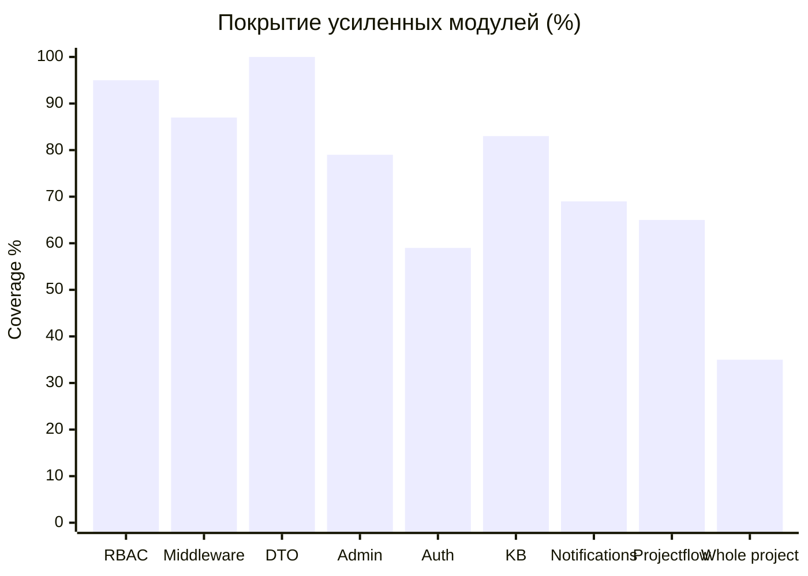
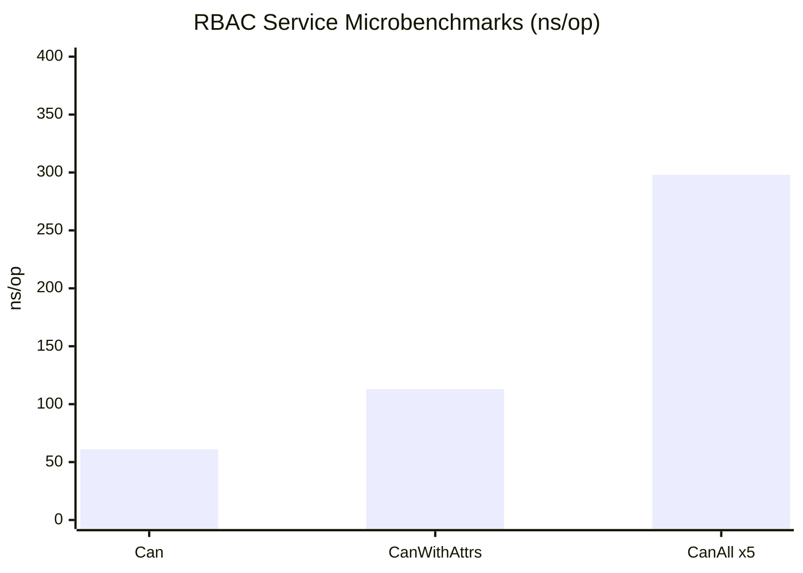
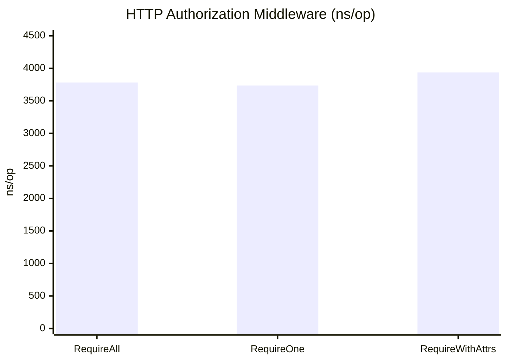

# Отчет По Тестированию И Бенчмаркам

Дата фиксации результатов: 2026-04-10

Документ фиксирует результаты проверки качества для `IDSAI Core` и может использоваться как приложение к дипломному проекту.

## 1. Что проверялось

Проверка разделена на четыре слоя:

- `unit/transport` тесты для бизнес-логики и HTTP-слоя;
- `security` тесты для сценариев несанкционированного доступа;
- `integration` тесты для связки `Go + PostgreSQL`;
- `benchmark` тесты для оценки накладных расходов RBAC и middleware.

Ключевая идея для диплома:

- центральным объектом оценки выступает `RBAC`;
- при этом RBAC проверяется не изолированно, а как часть полного web-приложения.

## 2. Команды Воспроизведения

Все основные команды вынесены в `Makefile`.

```bash
make test
make test-integration
make bench
make coverage
make report-artifacts
```

Цель `make report-artifacts` сохраняет сырые результаты в `.tmp/report/`.

## 3. Среда Измерения

- ОС: `linux`
- Архитектура: `amd64`
- CPU: `12th Gen Intel(R) Core(TM) i5-12450H`
- База данных для integration-тестов: `PostgreSQL 16`, запущенный через `docker compose`

Важно:

- benchmark-результаты зависят от железа и фоновой нагрузки;
- для диплома их лучше интерпретировать как `baseline` для данной конфигурации.

## 4. Сводный Результат

| Категория | Команда | Результат |
| --- | --- | --- |
| Unit / transport | `make test` | PASS |
| Integration | `make test-integration` | PASS |
| Security / BOLA | `go test ./internal/http/handlers -run 'TestProjectFlowHandlerGetMemberAccess' -v` | PASS |
| Coverage | `make coverage` | PASS |
| Benchmarks | `make bench` | PASS |

## 5. Security-Проверка

Отдельно проверен сценарий `Broken Object Level Authorization (BOLA)` для endpoint:

- `GET /v2/projects/:project_id/members/:user_id/access`

Фактически подтверждены два сценария:

| Тест | Ожидаемый результат | Фактический результат |
| --- | --- | --- |
| `TestProjectFlowHandlerGetMemberAccess_UsesTransportDTO` | `200 OK` для разрешенного запроса | PASS |
| `TestProjectFlowHandlerGetMemberAccess_DeniesBOLAForForeignMember` | `403 Forbidden` для подмены чужого `user_id` | PASS |

Подробное описание атаки и матрица результата уже вынесены в [BOLA_TESTING.md](/home/aibolat/diploma/idsai-core-up/docs/BOLA_TESTING.md).

## 6. Coverage

После усиления слабых мест общее покрытие проекта выросло с `27.8%` до `34.7%`.

Наиболее важные для диплома и демонстрации модули теперь выглядят так:

| Область | Coverage |
| --- | --- |
| `internal/services/rbac` | `94.7%` |
| `internal/http/middleware` | `86.8%` |
| `internal/http/dto` | `99.6%` |
| `internal/services/admin` | `78.9%` |
| `internal/services/auth` | `58.8%` |
| `internal/services/kb` | `82.9%` |
| `internal/services/notifications` | `69.3%` |
| `internal/services/projectflow` | `64.5%` |
| `internal/app` | `36.5%` |
| `internal/domain` | `100.0%` |
| `internal/config` | `100.0%` |
| `internal/requestctx` | `100.0%` |
| Весь проект | `34.7%` |

Ключевые покрытые ветки в RBAC:

- `ConditionRegistry.Register / Evaluate / Has` — `100%`
- `Service.Can` — `100%`
- `Service.CanAll` — `88.9%`
- `Service.CanWithAttributes` — `100%`
- `Service.Conditions` — `100%`
- `Service.ListPermissionCodes` — `100%`
- `Service.SetNow` — `100%`

Что именно было усилено:

- практически полностью закрыт слой `DTO`, который отвечает за корректность API-ответов;
- заметно усилены сервисные пакеты `admin`, `auth`, `kb`, `notifications`;
- добавлены дополнительные проверки для contact/email helper-логики в `app`.

Зона следующего усиления:

- общий coverage проекта все еще ограничивают крупные непокрытые слои `repos/postgres`, `cmd/*`, wiring в `app/*` и часть HTTP-handler'ов;
- в `projectflow` все еще слабо покрыты `ReturnProjectForRetake`, `DeleteProject`, `ListPositions`, `ListMembers`, `RejectMemberApplication`, `RemoveMember` и `SetMemberPosition`;
- в `http/handlers` слабее всего выглядят `auth_settings`, `admin` и часть `kb` endpoints.



## 7. Benchmark Результаты

### 7.1 RBAC Service

Команда:

```bash
go test ./internal/services/rbac -run '^$' -bench . -benchmem -benchtime=2s
```

Результаты:

| Benchmark | Время | Память | Аллокации |
| --- | --- | --- | --- |
| `BenchmarkServiceCan_ProjectScope` | `61.45 ns/op` | `0 B/op` | `0 allocs/op` |
| `BenchmarkServiceCanWithAttributes_ThreeConditions` | `112.5 ns/op` | `0 B/op` | `0 allocs/op` |
| `BenchmarkServiceCanAll_FivePermissions` | `298.1 ns/op` | `0 B/op` | `0 allocs/op` |



Интерпретация:

- базовая проверка `Can()` выполняется примерно за `61 ns`;
- добавление ABAC-условий увеличивает стоимость проверки, но сохраняет нулевые аллокации;
- пакетная проверка пяти permission-кодов остается ниже `1 us`.

### 7.2 HTTP RBAC Middleware

Команда:

```bash
go test ./internal/http/middleware -run '^$' -bench . -benchmem -benchtime=2s
```

Результаты:

| Benchmark | Время | Память | Аллокации |
| --- | --- | --- | --- |
| `BenchmarkRequirePermission_Allowed` | `3735 ns/op` | `5666 B/op` | `16 allocs/op` |
| `BenchmarkRequireAllPermissions_Allowed` | `3782 ns/op` | `5666 B/op` | `16 allocs/op` |
| `BenchmarkRequirePermissionWithAttrs_Allowed` | `3936 ns/op` | `6003 B/op` | `18 allocs/op` |



Интерпретация:

- полная HTTP-проверка авторизации укладывается примерно в `3.7-3.9 us` на запрос в тестовой среде;
- overhead ABAC-ветки немного выше обычного RBAC, что ожидаемо из-за дополнительной обработки атрибутов;
- различия внутри одного диапазона стоит трактовать как близкие по классу значения, потому что в benchmark входит не только RBAC, но и сам HTTP request path.

## 8. Что Можно Показывать На Защите

Для презентации и диплома лучше использовать такую связку:

1. Архитектурная часть: объяснить hierarchical RBAC и scope-модель.
2. Security-часть: показать BOLA-сценарий и факт отказа `403 Forbidden`.
3. Качественная часть: показать unit/integration результаты и coverage критических модулей.
4. Производительность: показать benchmark-таблицу и два графика по latency.

Практически это отвечает на два вопроса комиссии:

- система работает корректно?
- система делает проверки доступа достаточно быстро?

## 9. Рекомендации По Дальнейшему Усилению

- Добавить тесты для `CachedAuthorizer` с поднятым `Redis`.
- Добавить один `E2E smoke`-сценарий уровня `login -> project -> RBAC denial`.
- При необходимости вынести benchmark-результаты в отдельное приложение диплома как таблицу и два графика.
