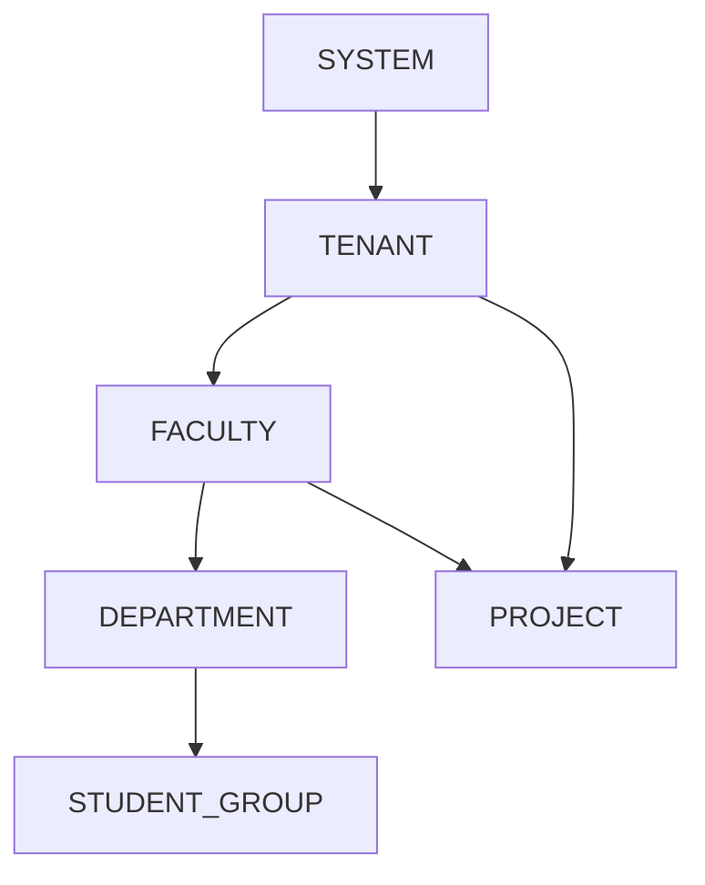
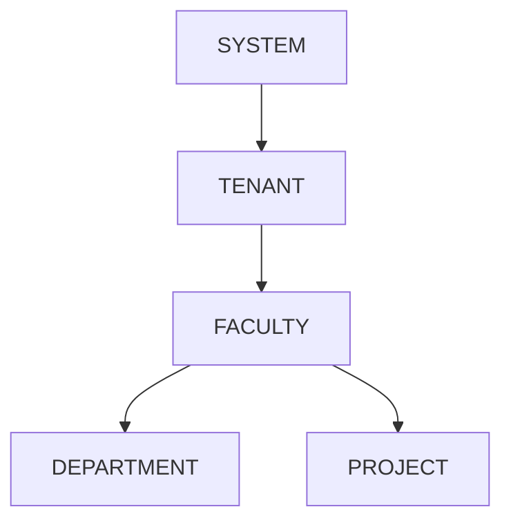
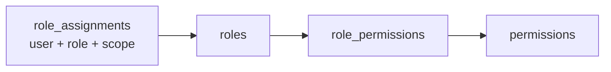
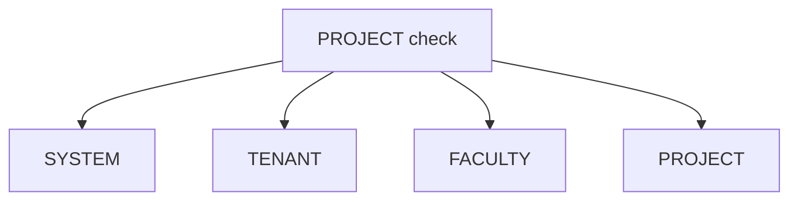
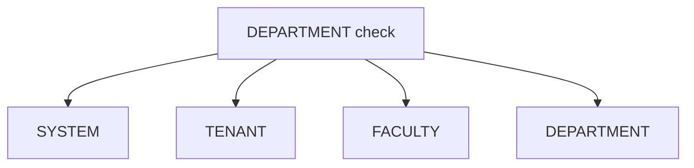
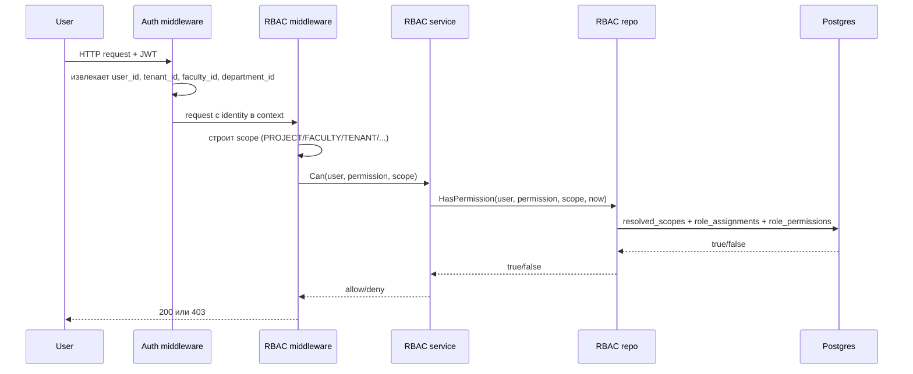
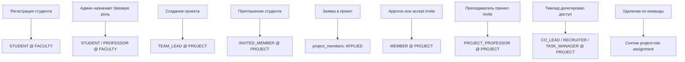
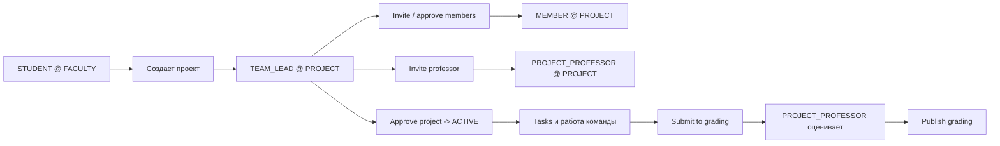
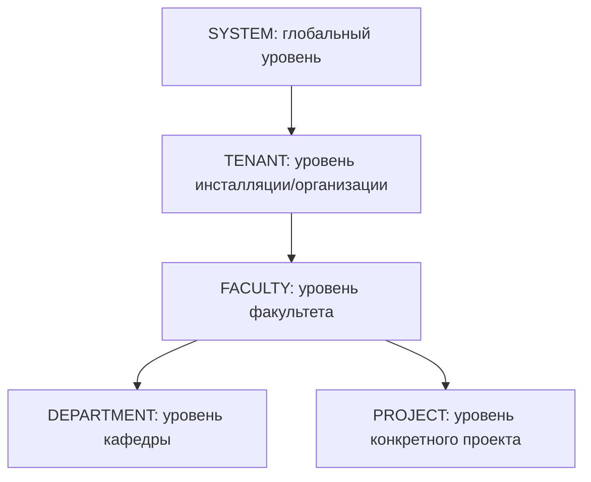

# RBAC и Иерархия Scope в IDSAI Core

Дата фиксации: 2026-04-10

Документ описывает, как в текущем коде устроены:

- иерархия сущностей;
- scope-модель доступа;
- RBAC-проверка на уровне middleware, service и SQL;
- назначение ролей в runtime;
- связь RBAC с lifecycle проекта.

Документ основан на фактической реализации в:

- `internal/http/middleware/auth.go`
- `internal/http/middleware/rbac.go`
- `internal/services/rbac/*`
- `internal/repos/postgres/rbac_repo.go`
- `internal/services/projects/service.go`
- `internal/services/projectflow/service_access.go`
- `internal/services/projectflow/service_members.go`
- `internal/services/projectflow/service_professors.go`
- `migrations/00002_rbac.sql`
- `migrations/00011_rbac_department_scope.sql`
- `migrations/00015_multitenant_notifications_docs.sql`
- `migrations/00038_rbac_delegated_project_roles.sql`

## 1. Коротко

Система работает как `RBAC with hierarchical scopes`.

Это значит:

1. Пользователю назначается роль на определенном scope.
2. Роль дает набор permission-кодов.
3. При проверке доступа система не смотрит только в один scope, а разворачивает его в список предков.
4. Если право найдено на одном из подходящих уровней, доступ разрешается.

Пример:

- у студента есть роль `STUDENT` в scope `FACULTY`;
- эта роль дает permission `member.apply`;
- при проверке `member.apply` на `PROJECT` внутри той же faculty доступ будет разрешен, потому что `PROJECT` наследует `FACULTY`.

## 2. Иерархия предметных сущностей

Текущая модель данных выглядит так:

Что важно:

- `faculty` принадлежит `tenant`;
- `department` принадлежит `faculty`;
- `student_group` принадлежит `department`;
- `project` принадлежит `tenant` и `faculty`;
- `project` может быть привязан к `group`, но не привязан к `department` напрямую.

Из этого следует важный нюанс:

- `DEPARTMENT` не участвует в наследовании прав для `PROJECT`, потому что проект не знает свой `department_id`.

## 3. Scope-модель RBAC

Поддерживаемые scope-уровни:

- `SYSTEM`
- `TENANT`
- `FACULTY`
- `DEPARTMENT`
- `PROJECT`

Они описаны в `internal/services/rbac/scope.go`.

Визуально это выглядит так:

То есть:

- `SYSTEM` выше всего;
- `TENANT` вложен в `SYSTEM`;
- `FACULTY` вложен в `TENANT`;
- `DEPARTMENT` вложен в `FACULTY`;
- `PROJECT` вложен в `FACULTY`.

## 4. Как хранятся роли и права

Базовая RBAC-модель хранится в трех таблицах:

### 4.1 `roles`

Каталог ролей:

- `SUPER_ADMIN`
- `TENANT_ADMIN`
- `STUDENT`
- `PROFESSOR`
- `MODERATOR`
- `TEAM_LEAD`
- `MEMBER`
- `INVITED_MEMBER`
- `PROJECT_PROFESSOR`
- `CO_LEAD`
- `RECRUITER`
- `TASK_MANAGER`

### 4.2 `permissions`

Каталог разрешений, например:

- `project.create`
- `project.view`
- `project.edit`
- `project.invite_professor`
- `project.submit_for_review`
- `project.approve`
- `project.delete`
- `project.review.respond`
- `position.create`
- `member.apply`
- `member.approve`
- `member.access.manage`
- `task.view`
- `task.create`
- `task.update`
- `task.assign`
- `task.claim`
- `task.delete`
- `grading.view`
- `grading.mark_criteria`
- `grading.publish`

### 4.3 `role_permissions`

Таблица связывает роль с permission-кодами.

Примеры:

- `STUDENT` получает `project.create`, `member.apply`;
- `TEAM_LEAD` получает `project.edit`, `member.approve`, `task.create`, `task.assign`, `project.submit_for_review`;
- `MEMBER` получает `project.view`, `task.view`, `task.claim`, `task.update`, `grading.view`;
- `PROJECT_PROFESSOR` получает `project.view`, `grading.view`, `grading.mark_criteria`, `grading.publish`;
- `CO_LEAD`, `RECRUITER`, `TASK_MANAGER` дают делегируемые project-права.

### 4.4 `role_assignments`

Это фактические назначения ролей пользователям.

Одна запись содержит:

- `tenant_id`
- `user_id`
- `role_id`
- `scope_type`
- `scope_id`
- `expires_at`

Пример:

- user `U1`
- role `TEAM_LEAD`
- scope `PROJECT`
- scope_id `project-123`

Это значит: пользователь `U1` является `TEAM_LEAD` конкретного проекта.

## 5. Как работает наследование scope

Сердце модели находится в SQL CTE `resolved_scopes` в `internal/repos/postgres/rbac_repo.go`.

Система не хранит отдельную таблицу иерархии прав. Вместо этого она вычисляет допустимые scope во время каждой проверки.

### 5.1 Если проверяется `PROJECT`

Для `PROJECT` система разворачивает scope в:

- `SYSTEM`
- `TENANT`
- `FACULTY`
- `PROJECT`

В виде диаграммы:

Это означает:

- право, выданное на `PROJECT`, срабатывает только на этом проекте;
- право, выданное на `FACULTY`, срабатывает на всех проектах этого faculty;
- право, выданное на `TENANT`, срабатывает на всех faculty и проектах tenant;
- `SYSTEM` покрывает все.

### 5.2 Если проверяется `DEPARTMENT`

Для `DEPARTMENT` система разворачивает scope в:

- `SYSTEM`
- `TENANT`
- `FACULTY`
- `DEPARTMENT`

### 5.3 Если проверяется `FACULTY`

Для `FACULTY` система разворачивает scope в:

- `SYSTEM`
- `TENANT`
- `FACULTY`

### 5.4 Если проверяется `TENANT`

Для `TENANT` система разворачивает scope в:

- `SYSTEM`
- `TENANT`

### 5.5 Если проверяется `SYSTEM`

Для `SYSTEM` разрешен только:

- `SYSTEM`

## 6. Полный путь проверки доступа

Ниже показан путь запроса от JWT до SQL.

### 6.1 Auth middleware

`internal/http/middleware/auth.go` делает следующее:

- валидирует access token;
- извлекает из claims:
  - `tenant_id`
  - `faculty_id`
  - `department_id`
  - `user_id`
- кладет их в `gin.Context` и `request context`.

Это нужно, чтобы потом middleware и сервисы могли строить scope без дополнительных запросов к БД.

### 6.2 RBAC middleware

`internal/http/middleware/rbac.go`:

- берет `user_id` из context;
- строит `rbac.Scope` через resolver;
- вызывает `authz.Can(...)`;
- при `false` возвращает `403`.

Примеры resolver-ов:

- `ProjectScopeFromParam("project_id")`
- `FacultyScopeFromCtx()`
- `TenantScopeFromCtx()`
- `DepartmentScopeFromCtx()`
- `SystemScope()`

### 6.3 RBAC service

`internal/services/rbac/service.go`:

- валидирует scope;
- передает проверку в repository;
- опционально может сверху применить ABAC-условия через `CanWithAttributes`.

### 6.4 SQL repository

`internal/repos/postgres/rbac_repo.go`:

- строит `resolved_scopes`;
- соединяет:
  - `role_assignments`
  - `role_permissions`
  - `permissions`
- проверяет:
  - совпадение `user_id`
  - совпадение `tenant_id`
  - scope-попадание
  - актуальность `expires_at`
  - наличие нужного `permission`.

## 7. Когда роли назначаются в runtime

Ниже показано, как role assignments появляются в системе.

### 7.1 Регистрация студента

При регистрации студент получает `STUDENT` в scope `FACULTY`.

Это делается в `internal/repos/postgres/auth_repo.go` через `GrantStudentFacultyRole`.

Результат:

- студент может создавать проект в своей faculty;
- студент может подавать заявки в проекты своей faculty.

### 7.2 Создание проекта

При создании проекта автор автоматически получает:

- `TEAM_LEAD @ PROJECT`

Это делается в `internal/services/projects/service.go`.

### 7.3 Приглашение участника

При приглашении студенту выдается:

- `INVITED_MEMBER @ PROJECT`

Это делается в `internal/services/projectflow/service_members.go`.

### 7.4 Одобрение участника или принятие инвайта

Когда пользователь становится активным участником, ему выдается:

- `MEMBER @ PROJECT`

И обычно снимается:

- `INVITED_MEMBER @ PROJECT`

### 7.5 Принятие приглашения преподавателем

Когда преподаватель принимает приглашение в проект, ему выдается:

- `PROJECT_PROFESSOR @ PROJECT`

### 7.6 Делегированные роли внутри проекта

Тимлид может выдать участнику одну или несколько ролей:

- `CO_LEAD`
- `RECRUITER`
- `TASK_MANAGER`

Они существуют только в scope `PROJECT`.

## 8. Как это связано с project lifecycle

Самый полезный практический сценарий:

Это важно, потому что RBAC у вас не живет отдельно от бизнес-логики. Он плотно встроен в lifecycle.

Примеры:

- `TEAM_LEAD` нужен, чтобы открывать recruitment, звать участников, назначать преподавателя, создавать задачи;
- `MEMBER` нужен для участия в задачах, claim и submit;
- `PROJECT_PROFESSOR` нужен для grading и publish;
- `STUDENT @ FACULTY` нужен, чтобы вообще иметь право войти в pipeline через `project.create` и `member.apply`.

## 9. Практические примеры проверки

### 9.1 Почему `member.apply` работает на проекте

Сценарий:

- у пользователя есть `STUDENT @ FACULTY`;
- роль `STUDENT` дает permission `member.apply`;
- endpoint `POST /v2/projects/:project_id/members/apply` завязан на project flow.

Почему это проходит:

1. middleware проверяет permission для `PROJECT`;
2. `PROJECT` разворачивается в `SYSTEM + TENANT + FACULTY + PROJECT`;
3. faculty-assignment `STUDENT` попадает в `resolved_scopes`;
4. permission находится;
5. доступ разрешается.

### 9.2 Почему `project.view` может прийти не только от project-role

Если у пользователя есть:

- `PROFESSOR @ FACULTY`

и эта роль на faculty имеет:

- `project.view`
- `task.view`
- `grading.view`

то эти права сработают и на project-уровне внутри того же faculty.

Именно это добавлено миграцией `00037_rbac_professor_faculty_project_read.sql`.

### 9.3 Почему owner проекта часто имеет особый путь

Некоторые проверки в сервисном слое не ограничиваются чистым RBAC.

Например:

- автор проекта при создании получает `TEAM_LEAD`;
- для отдельных операций код дополнительно проверяет owner/member state;
- в `projects.Service` viewer access частично выводится не только из RBAC, но и из `created_by`.

То есть у вас есть RBAC как основа, но местами поверх него лежит бизнес-логика.

## 10. Где у вас уже есть ABAC

Система не ограничивается только RBAC-интерфейсом.

Есть `ConditionRegistry` и `CanWithAttributes`:

- `internal/services/rbac/condition.go`
- `internal/services/rbac/service.go`
- `internal/http/middleware/rbac.go`

Сейчас это работает как дополнительный слой:

1. сначала проходит обычный RBAC;
2. затем проверяются runtime-атрибуты.

Пример, зарегистрированный в `internal/modules/rbac/module.go`:

- `task.edit` разрешен, если:
  - `user_id == task_author_id`
  - `project_status != COMPLETED`

Важно:

- на текущий момент это скорее заготовка для ABAC;
- основная реальная модель доступа в системе сейчас все же RBAC с иерархией scope.

## 11. Ограничения текущей модели

### 11.1 `PROJECT` не наследует `DEPARTMENT`

Это не баг SQL. Это следствие модели данных:

- проект привязан к `faculty`, а не к `department`.

Из-за этого:

- `DEPARTMENT`-роль не может автоматически давать доступ к `PROJECT`,
- если только вы явно не перепишете иерархию или не добавите `department_id` в `projects`.

### 11.2 Часть доступа идет не только через RBAC

Некоторые решения в коде принимаются не только по `authz.Can(...)`, но и по дополнительной бизнес-логике:

- owner-check;
- member active-state;
- professor assigned-state;
- lifecycle status.

Это нормально, но это значит, что "право есть" не всегда равно "операция разрешена".

### 11.3 Scope inheritance зашит в SQL

Плюс:

- быстро и прозрачно;
- не нужен отдельный authorization service.

Минус:

- иерархия сильно привязана к структуре БД;
- добавить новый уровень scope или новую ветку наследования не совсем дешево.

## 12. Ментальная модель для команды

Проще всего запомнить так:

Правило чтения:

- если право выдано выше, оно может сработать ниже;
- но только по тем веткам, которые реально описаны в `resolved_scopes`.

Значит:

- `FACULTY -> PROJECT` работает;
- `DEPARTMENT -> PROJECT` сейчас не работает;
- `TENANT -> FACULTY/PROJECT` работает;
- `SYSTEM -> все` работает.

## 13. Чек-лист для чтения кода

Если нужно быстро понять, почему endpoint разрешен или запрещен, идите в таком порядке:

1. Посмотреть route и middleware:
   - `internal/http/router_*.go`
   - `internal/http/middleware/rbac.go`
2. Понять, какой именно scope строится:
   - `ProjectScopeFromParam`
   - `FacultyScopeFromCtx`
   - `TenantScopeFromCtx`
   - `DepartmentScopeFromCtx`
3. Посмотреть, какая permission проверяется.
4. Найти, какие роли дают эту permission:
   - миграции `00002`, `00004`, `00008`, `00033`, `00037`, `00038`, `00040`
5. Понять, назначена ли пользователю одна из этих ролей:
   - `role_assignments`
6. Проверить, попадает ли scope в `resolved_scopes`.
7. После этого проверить бизнес-ограничения в service-слое:
   - project status
   - member status
   - ownership
   - assigned professor
   - capacity

## 14. Итог

Текущая модель доступа в проекте:

- не flat RBAC;
- не полноценный внешний auth service;
- не relationship graph;
- а `RBAC + hierarchical scopes + немного ABAC`.

Главный принцип:

> Пользователь получает роль на некотором scope, а система при проверке доступа разворачивает scope в цепочку предков и ищет нужное permission по всем допустимым уровням.

Если упростить до одной фразы:

> `SYSTEM` покрывает все, `TENANT` покрывает все внутри tenant, `FACULTY` покрывает проекты и кафедры faculty, `DEPARTMENT` покрывает только department-level доступ, `PROJECT` покрывает только конкретный проект.
